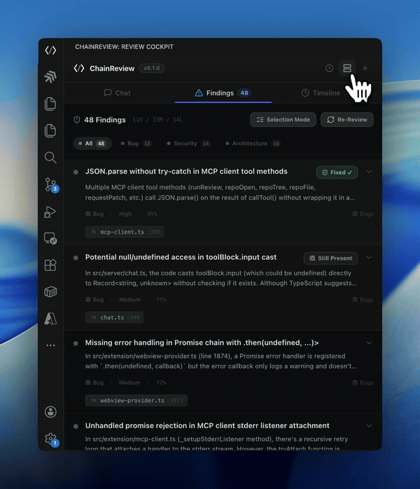

<p align="center">
  
</p>

<h1 align="center">ChainReview</h1>

<p align="center">
  Multi-agent AI code reviewer for VS Code.<br />
  Five specialized agents. Evidence-backed findings. Validated patches. Full audit trail.
</p>

<p align="center">
  <a href="https://github.com/charannyk06/ChainReview/stargazers"></a>
  <a href="https://marketplace.visualstudio.com/items?itemName=chainreview.chainreview"></a>
  <a href="https://github.com/charannyk06/ChainReview/blob/main/LICENSE"></a>
  <a href="https://github.com/charannyk06/ChainReview/issues"></a>
</p>

---

## Demo

<p align="center">
  
</p>

<p align="center"><em>Finding detail — evidence, code context, Generate Fix and Verify Fix pipeline</em></p>

<p align="center">
  
</p>

<p align="center"><em>Live findings list — Fixed / Still Present badges, severity, confidence scores</em></p>

<p align="center">
  
</p>

<p align="center"><em>Audit timeline — every agent action, tool call, and finding timestamped</em></p>

---

## What is ChainReview?

Most AI code reviewers are single-agent, text-output-only, and non-replayable. ChainReview is different.

It runs **five specialized agents in parallel** inside VS Code — each grounding its analysis in real static tooling (Semgrep, TypeScript compiler, ripgrep, import graph). Findings come with file paths, line ranges, code snippets, and confidence scores. Patches are syntax-validated before you see them. Every agent action is recorded in a local SQLite audit log.

> Built for the **Built with Claude: Claude Code Hackathon** by Anthropic.

---

## Features at a Glance

| | |
|---|---|
| **5 specialized agents** | Architecture · Security · Bugs · Validator · Explainer |
| **Evidence-backed findings** | File path + line range + code snippet + confidence score |
| **Validated patches** | TypeScript compiler + clean-apply check before you see a fix |
| **Coding agent handoff** | Send findings to Claude Code, Cursor, Windsurf, Copilot, or Codex |
| **Audit trail** | 8 event types recorded in local SQLite — fully replayable |
| **@mention routing** | `@security`, `@bugs`, `@architecture` — run only what you need |
| **Diff mode** | Review only staged/unstaged changes — fast PR-style feedback |
| **MCP extensible** | Add external MCP servers from the UI |

---

## Five Agents, One Pipeline

| Agent | What it catches |
|---|---|
| **Architecture** | Coupling, circular dependencies, boundary violations |
| **Security** | Injection, auth gaps, crypto issues, data exposure |
| **Bugs** | Logic errors, null refs, race conditions, edge cases |
| **Validator** | Challenges findings from other agents — cuts false positives |
| **Explainer** | Deep-dive on any finding, on demand |

Architecture, Security, and Bugs run **in parallel** via `Promise.allSettled`. Validator then challenges the combined result. Explainer fires on demand.

---

## Quick Start

**Prerequisites:** Node.js 18+, VS Code 1.90+, Anthropic API key, Semgrep (optional: `brew install semgrep`)

```bash
git clone https://github.com/charannyk06/ChainReview.git
cd ChainReview
npm install && npm run build
```

Press **F5** in VS Code → Extension Development Host → click the `</>` ChainReview icon in the activity bar.

```bash
# Set your API key in VS Code Settings > ChainReview, or:
export ANTHROPIC_API_KEY="sk-ant-..."
```

---

## Finding Workflow

```
Finding card
  ├── Explain          → Explainer agent deep-dive
  ├── Generate Fix     → LLM-generated unified diff patch
  ├── Verify Fix       → Validator re-checks the proposed fix
  ├── Handoff To       → Claude Code / Cursor / Windsurf / Copilot / Codex
  └── False Positive   → Dismiss and record
```

Patches go through **TypeScript syntax check (ts-morph)** and **clean-apply verification** before you see them. "Fixed" and "Still Present" badges update after Verify.

---

## Review Modes

| Mode | What gets reviewed |
|---|---|
| **Full Repository** | Entire codebase — file tree, import graph, Semgrep |
| **Diff Review** | Staged + unstaged changes only — fast PR-style feedback |
| **Chat** | Ask questions about the codebase using the same CRP tools |

---

## Audit Trail

Eight event types, timestamped and stored locally in SQLite (`~/.chainreview/chainreview.db`):

```
agent_started → evidence_collected → finding_emitted → patch_proposed
→ patch_validated → human_accepted → human_rejected → false_positive_marked
```

Browse the full timeline in the **Audit Trail** tab. No telemetry. No cloud sync. Fully replayable.

---

## Privacy and Security

ChainReview is designed with a local-first, defense-in-depth security model. No code or review data leaves your machine unless you explicitly initiate a request to the Claude API.

- **Local-first storage** — all review data is stored in `~/.chainreview/chainreview.db` (SQLite). No telemetry, no cloud sync.
- **Local static analysis** — Semgrep runs entirely on your machine. No code is sent to external scanning services.
- **Secrets redaction** — API keys, tokens, and passwords are stripped from code snippets before they are sent to the Claude API.
- **No destructive actions without confirmation** — patches require explicit manual Apply. No file is modified automatically.
- **Path traversal protection** — the patch engine enforces repository boundary checks. Patches cannot write outside the root of the open repository.
- **Allowlisted shell execution** — the `crp.exec.command` tool only runs commands from an explicit allowlist. Arbitrary shell execution is blocked.
- **API key handling** — your Anthropic API key is stored using VS Code's built-in secret storage and is never written to disk in plaintext.
- **Minimal network surface** — the only outbound connections are to `api.anthropic.com` (LLM calls) and, optionally, the Brave Search API if web search is enabled.

---

## CRP Tool Schema

ChainReview Protocol (CRP) is an open, MCP-compatible tool schema. All tools are available to agents and the chat interface.

<details>
<summary>Full tool reference (20+ tools)</summary>

### Repo Context
| Tool | Description |
|---|---|
| `crp.repo.open` | Initialize a repository for review |
| `crp.repo.tree` | File tree with depth and pattern filtering |
| `crp.repo.file` | Read file contents with optional line range |
| `crp.repo.search` | Ripgrep search with regex, glob, result limits |
| `crp.repo.diff` | Git diff (staged, unstaged, or between refs) |

### Code Analysis
| Tool | Description |
|---|---|
| `crp.code.import_graph` | TypeScript import graph with cycle detection (ts-morph) |
| `crp.code.pattern_scan` | Semgrep static analysis with configurable rules |

### Patch Operations
| Tool | Description |
|---|---|
| `crp.patch.propose` | Generate a unified diff patch for a finding |
| `crp.patch.validate` | Validate patch (clean apply + TypeScript syntax) |
| `crp.patch.apply` | Apply a validated patch to disk |
| `crp.patch.generate` | Generate fixed code via LLM reasoning |

### Review Orchestration
| Tool | Description |
|---|---|
| `crp.review.run` | Run full review pipeline |
| `crp.review.cancel` | Cancel an active review |
| `crp.review.get_findings` | Query findings by run ID |
| `crp.review.get_events` | Query audit events by run ID |
| `crp.review.validate_finding` | Run validator on a single finding |
| `crp.review.record_event` | Record a chain-of-review event |

### Utilities
| Tool | Description |
|---|---|
| `crp.chat.query` | Ask a question about the repository |
| `crp.exec.command` | Run allowlisted shell commands |
| `crp.web.search` | Web search via Brave Search API |

</details>

---

## Tech Stack

| Layer | Technology |
|---|---|
| Extension | VS Code Extension API, esbuild |
| Server | Node.js, MCP SDK, better-sqlite3, ts-morph, simple-git |
| UI | React 18, Framer Motion, Lucide Icons |
| LLM | Anthropic Claude API (claude-opus-4-6) |
| Static Analysis | Semgrep (local) |
| Build | Vite 6, esbuild, TypeScript 5.7 |

---

## Roadmap

- [ ] VS Code Marketplace publish
- [ ] CLI tool for CI/CD integration
- [ ] GitHub PR commenting + draft PR creation
- [ ] Azure DevOps native integration
- [ ] Multi-language support beyond TypeScript
- [ ] Custom agent creation

---

## Development

```bash
npm install
npm run build        # all targets
npm run dev          # watch mode
npm run test         # all tests
```

---

## License

[Apache License 2.0](LICENSE)

---

## Acknowledgments

Powered by [Claude](https://anthropic.com) · [Model Context Protocol](https://modelcontextprotocol.io) · [Semgrep](https://semgrep.dev) · [ts-morph](https://github.com/dsherret/ts-morph)
